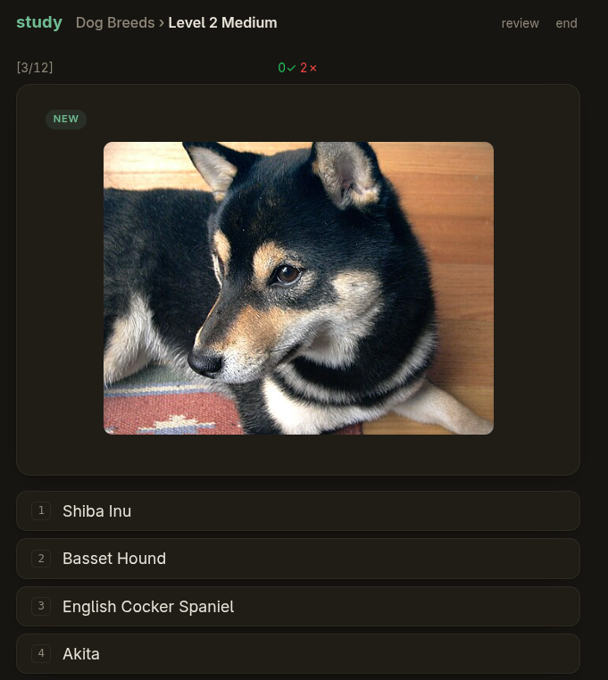

# study

A flashcard quiz tool. Decks are plain text files. Available for Linux and web. Test out the web version here:

[study.fftp.io](https://study.fftp.io/)

The default study mode, `adaptive`, is a [spaced-repetition](https://en.wikipedia.org/wiki/Spaced_repetition) scheduler based on evidence gathered from these papers:

| Paper | Takeaway |
|-------|----------|
| [Rawson & Dunlosky 2011](https://pubmed.ncbi.nlm.nih.gov/21707204/) | The session criterion: three correct recalls for new material, one per relearning session. |
| [Karpicke & Bauernschmidt 2011](https://learninglab.psych.purdue.edu/downloads/2011/2011_Karpicke_Bauernschmidt_JEPLMC.pdf) | Within-session spacing: any nonzero gap between repetitions beats none, and the gap pattern doesn't matter. |
| [Kornell & Bjork 2008](https://doi.org/10.1111/j.1467-9280.2008.02127.x) | Interleaving: a card confused with another is pulled near it, so the pair is told apart. |
| [Atkinson 1972](https://doi.org/10.1037/h0033475) | Gradual introduction: new cards enter a few at a time as earlier ones are learned, not as one big batch. |
| [Cowan 2001](https://doi.org/10.1017/S0140525X01003922) | The size of the introduction window. |

# Compared to Anki

- Anki flips the card and you grade yourself. In study the answer is
  provided by the user and grading is the program's job.
- study decks are plain text. Great for version control. Anki keeps a
  SQLite collection for storing decks.
- In study, if a wrong answer that belongs to another card is provided,
  study pulls it near, so the pair can be distinguished while the
  confusion is fresh. Anki has nothing like this.
- Anki shows a due card once and moves on. study keeps a card in the
  session until it earns its exit: three correct answers when new, one
  on review, always with other cards in between so the user can't
  simply rely on short-term memory.

# Screenshots

## Desktop


## Web



# Getting started

- Requires Go.
- Installs to `~/.local/bin`.

To install, run:

```bash
make clean install
```

Save this as `example.deck`:

```
2 + 2
---
4

What is the capital of Canada?
---
Ottawa
~ Toronto
~ Vancouver
~ Montreal
```

- The two cards above are separated by a blank line.
- `---` or `===` separate question and answer.
- In the first card above, the user is prompted with `2 + 2` and must type `4`.
- In the second card above, the user is prompted with multiple choice options.
- The `~` mark indicates a wrong answer.

Run it:

```bash
study example.deck
```

For more, [examples/basic.deck](examples/basic.deck) is a small beginner deck,
and the [language packs](https://github.com/wickedjargon/study-language-packages)
are full-size decks with audio, native script, and pack directories.

# Web version

```bash
make study-web
./study-web [flags] <deck-or-dir>...
```

Each argument is a deck (a `*.deck` file or pack directory), or a directory of
decks. `group=path` nests a pack as a topic of an existing group;
`path@Display Name` overrides the name shown. `make run` starts the server
with this machine's decks — see [RUNNING.md](RUNNING.md).

The web version follows the same scheduler as the desktop, with two guest
conveniences: unseen cards introduce themselves once before being quizzed
("skip intros" turns that off), and every deck offers a review mode that flips
through cards, answers visible, without recording anything.

# Desktop usage

```
study [flags] [deck-file | pack-directory]
```

| Flag | Description |
|------|-------------|
| `--reverse` | Flip the deck: see the English, produce the target language |
| `--order <mode>` | Override the deck's card order for this session. See [Card order](#card-order) |
| `--answer-mode <type\|choice>` | Force how every card is answered this session, overriding the deck's `# answer-mode:` and per-card settings. Note the card's progress history is shared between modes, and recognition (choice) successes are easier evidence than production (type) ones |
| `--ahead <N\|all>` | Adaptive order: also review cards due within N days, or all scheduled. See [Card order](#card-order) |
| `--time-limit <N\|none>` | Override the per-question time limit, uniformly for every card |
| `--wrong-pause <N\|none>` | How long a wrong answer's result screen refuses to advance (default 5s) |
| `--preview-new` | Reveal a never-studied card's answer once before quizzing it |
| `--new-per-session <N\|all>` | How many never-studied cards enter an adaptive session (default 10) |
| `--font-size <N>` | Override the base font size (8–48, or `small`/`medium`/`large`/`x-large`) |
| `--audio-speed <X>` | Override audio playback speed (0.25–4.0) |
| `--stats` | Print progress summary (incl. what's due) and exit |
| `--forget` | Clear saved progress for the studied direction only (combine with `--reverse`) |
| `--watch <dir>` | Add a directory to the [library](#library) |
| `--unwatch <dir>` | Remove a watched directory |
| `--library` | Print the library with due counts and exit |
| `--help` | Show help |

## Library

Running `study` with no deck argument opens the library: every deck you
keep for long-term study, with due counts for both directions and when
each was last studied. Pick a deck and a session starts. When it ends
you land back in the library with fresh counts, ready for the next
deck.

Membership is explicit. Studying a file never shelves it, so trying out
a downloaded deck with `study test.deck` leaves your library untouched.
The library is the directories you watch:

```bash
study --watch ~/decks
```

Every `*.deck` file in a watched directory is a library deck, and every
subdirectory containing `*.deck` files is a library pack. To shelve a
deck for good, move it into a watched directory.

Library screen keys: `enter` studies the selected deck as a direct run
would. On a pack, `enter` studies everything merged and `tab` unfolds
it so one of its decks can be picked instead, like the web version's
group page. `r` studies the selection reversed. `f` flips through it
without recording.
`w` crams its weak cards. `t` and `c` force every card to typed or
multiple choice for the session, like `--answer-mode`. `x` forgets the
deck: all its saved progress is cleared (after a confirm), the deck
itself stays shelved. `j`/`k` or arrows move, `q` quits.

## Card order

Set with the `--order` flag or the `# order:` deck header:

| Mode | Behavior |
|------|----------|
| `adaptive` | **Default: "what's due?"** Reviews that are due plus a batch of new cards, with spaced repetitions. Review intervals grow across days. When nothing is due, says so — and offers to keep studying anyway, ahead of schedule; new cards still enter a batch at a time, and early reviews don't advance the intervals (see `--ahead`). A deck already studied today opens on the same notice: the next batch of new cards waits for a deliberate `c`, since batches spaced across days are where the retention gains come from. |
| `sequential` | **"In order."** Deck order, wrapping forever. Misses get the immediate-repeat drill. For material where the sequence is the content: verse, digits, procedures. |
| `flip-through` | **"Just show me."** Answers visible, enter advances, wraps at the end. Nothing recorded. |
| `weak-only` | **"What am I bad at?"** Cram mode: only weak or never-studied cards, ignoring review dates. |

# Deck format

## Accepted answers

`=` after the answer adds an extra accepted answer (type mode). Matching is
lenient by default. Case, accents, punctuation, and extra spaces are
forgiven (`salam` matches `salâm`), and common English notation matches its
expansions in both directions — no `=` variant needed:

- contractions: `I don't understand` matches `I do not understand`; ambiguous
  forms accept either reading (`she's` matches `she is` and `she has`)
- numbers and ordinals: `two seconds` matches `2 seconds`, `1st` matches `first`
- unit abbreviations: `5m`, `5 m`, and `five metres` all match `5 metres`
  (only the short form expands: `5 miles` never matches `5 metres`)
- British/American spellings: `5 meters`, `colour`/`color`, `recognise`/`recognize`
- symbols: `rock & roll` matches `rock and roll`, `50 %` matches `50 percent`,
  `50 km/h` matches `50 kilometres per hour`

Bare words that merely look like short forms (`ill`, `were`, `in`) are never
expanded:

```
bonjour
---
hello
= hi
```

## Alternative prompt wordings

`=` on the question side is an alternative wording of the prompt, accepted
when the prompt is what you type (`--reverse`). It's never displayed, and
adding one doesn't re-key the card:

```
¿Prefiere ventanilla o pasillo?
= prefieres ventanilla o pasillo
---
do you prefer window or aisle
```

## Media

`@img` and `@audio` ride on the side they're written on. Paths are relative
to the deck file, and audio plays automatically (needs `mpv` or `aplay`):

```
@img flags/japan.png
@audio audio/konnichiwa.mp3
How do you say "hello"?
---
こんにちは
```

## Cloze

A card with no separator and a `{{...}}` deletion blanks the braced text
(`____`) and makes it the answer. Multiple deletions join in order:

```
The capital of France is {{Paris}}.
```

## Per-card overrides

`# answer-mode:`, `# choice-count:`, and `# time-limit:` inside a card block
apply to that card only (`# time-limit: none` exempts it):

```
# choice-count: 2
# time-limit: none
What is 1 + 1?
---
2
```

## Header directives

| Header | Flag | Values | Default |
|--------|------|--------|---------|
| `# answer-mode:` | file-only | `choice`, `type` | `type` |
| `# choice-count:` | file-only | integer ≥ 2 | `4` |
| `# answer-case:` | file-only | `sensitive`, `insensitive` | `insensitive` |
| `# time-limit:` | `--time-limit` | seconds, or `none` | `none` |
| `# order:` | `--order` | see [Card order](#card-order) | `adaptive` |
| `# preview-new:` | `--preview-new` | `on`, `off` | `off` |
| `# new-per-session:` | `--new-per-session` | integer ≥ 0, or `all` | `20` |
| `# wrong-pause:` | `--wrong-pause` | seconds, or `none` | `5` |
| `# font-size:` | `--font-size` | `8`–`48`, or `small`/`medium`/`large`/`x-large` | `10` |
| `# audio-speed:` | `--audio-speed` | `0.25`–`4.0` | `1.0` |

- A flag overrides the deck-header setting of the same name for that session.

# Controls

| Key | Action |
|-----|--------|
| `1`–`9` | Select answer (choice mode) |
| Type + `Enter` | Submit answer (type mode) |
| `Backspace` | Delete character (type mode) |
| `Ctrl`+`V` / middle-click | Paste clipboard / primary selection (type mode) |
| `Enter` / `Space` | Continue after result / preview (a wrong answer pauses this for `# wrong-pause:` seconds, counted down in the timer's corner) |
| `Ctrl`+`R` | Replay audio (in reverse mode, the reveal's clip on the result screen) |
| `Ctrl`+`,` / `Ctrl`+`.` | Slow down / speed up audio and replay (0.25 steps, 0.25–4x, needs `mpv`) |
| `Ctrl`+`/` | Reset audio speed |
| `Ctrl`+`=` / `Ctrl`+`-` / `Ctrl`+`0` | Grow / shrink / reset font size |
| `Escape` | End session (summary screen, `Escape` or `Enter` exits) |
| `c` | Keep studying from the summary or caught-up screen: the waiting new batch, or a full ahead-of-schedule pass |
