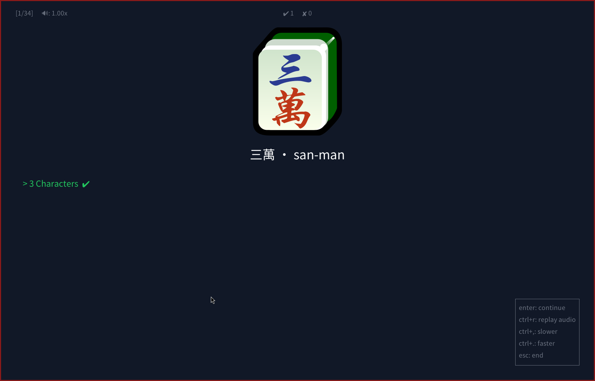
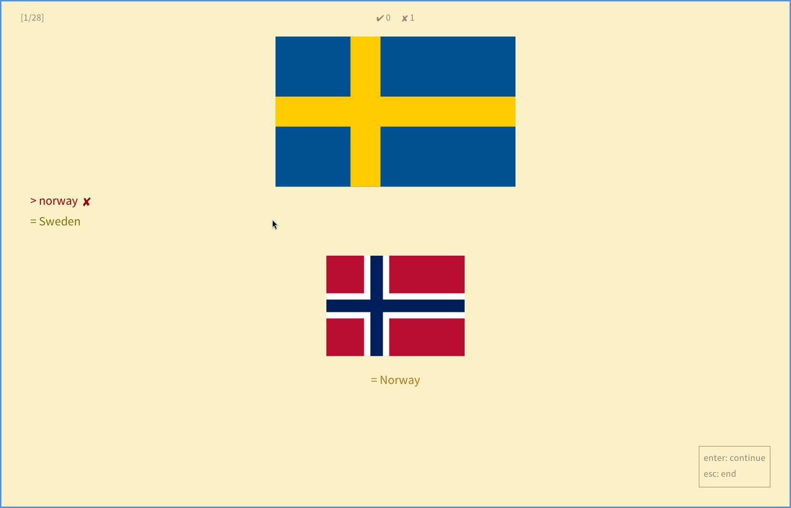

# study

A flashcard quiz tool inspired by suckless sent. Decks are plain text files. Sessions run in a minimal X11 window. The default card-ordering follows evidence-based [spaced repetition](https://en.wikipedia.org/wiki/Spaced_repetition).

The papers behind the default ordering:

- [Optimizing Schedules of Retrieval Practice for Durable and Efficient Learning](https://pubmed.ncbi.nlm.nih.gov/21707204/)
- [Spaced Retrieval: Absolute Spacing Enhances Learning Regardless of Relative Spacing](https://learninglab.psych.purdue.edu/downloads/2011/2011_Karpicke_Bauernschmidt_JEPLMC.pdf)

# Screenshots





# Getting started

- Requires Go.
- Installs to `~/.local/bin`.

To install, run:

```bash
make clean install
```

Save this as `example.deck`:

```
2 + 2
---
4

What is the capital of Canada?
---
Ottawa
~ Toronto
~ Vancouver
~ Montreal
```

- The two cards above are separated by a blank line.
- `---` or `===` separate question and answer.
- In the first card above, the user is prompted with `2 + 2` and must type in 4 using his keyboard.
- In the second card above, the user is prompted with multiple choice options.
- `~` indicate an incorrect answer.

Run it:

```bash
study example.deck
```

For more, [examples/basic.deck](examples/basic.deck) is a small beginner deck,
and the [language packs](https://github.com/wickedjargon/study-language-packages)
are full-size decks with audio, native script, and pack directories.

# Usage

```
study [flags] <deck-file | pack-directory>
```

| Flag | Description |
|------|-------------|
| `--reverse` | Flip the deck: see the English, produce the target language |
| `--order <mode>` | Override the deck's card order for this session. See [Card order](#card-order) |
| `--ahead <N\|all>` | Adaptive order: also review cards due within N days, or all scheduled. See [Card order](#card-order) |
| `--time-limit <N\|none>` | Override the per-question time limit, uniformly for every card |
| `--wrong-pause <N\|none>` | How long a wrong answer's result screen refuses to advance (default 5s) |
| `--preview-new` | Reveal a never-studied card's answer once before quizzing it |
| `--new-per-session <N\|all>` | How many never-studied cards enter an adaptive session (default 20) |
| `--font-size <N>` | Override the base font size (8–48, or `small`/`medium`/`large`/`x-large`) |
| `--audio-speed <X>` | Override audio playback speed (0.25–4.0) |
| `--stats` | Print progress summary (incl. what's due) and exit |
| `--forget` | Clear saved progress for the studied direction only (combine with `--reverse`) |
| `--help` | Show help |

- A directory is a **pack**: every `*.deck` inside merges into one session.
- A flag overrides the deck-header setting of the same name for that session
  (`answer-mode`, `answer-case`, and `choice-count` are file-only).

## Card order

Set with the `--order` flag or the `# order:` deck header:

| Mode | Behavior |
|------|----------|
| `adaptive` | **Default: "what's due?"** Reviews whose date arrived (most overdue first) plus a batch of new cards. A new card needs 3 correct recalls, a review 1. Repetitions are spaced, never back-to-back. A clean session moves a card up the review ladder (1, 3, 7, 14, 30, 60, 120 days). A miss drops it to half its rung: relearning is faster than learning, so history isn't discarded. Completes when every card is done. When nothing is due, it says so and exits. |
| `sequential` | **"In order."** Deck order, wrapping forever. Misses get the immediate-repeat drill. For material where the sequence is the content: verse, digits, procedures. |
| `flip-through` | **"Just show me."** Answers visible, enter advances, wraps at the end. Nothing recorded. |
| `weak-only` | **"What am I bad at?"** Cram mode: only weak or never-studied cards, ignoring review dates. |

# Deck format

## Accepted answers

`=` after the answer adds an extra accepted answer (type mode). Matching is
lenient by default. Case, accents, punctuation, and extra spaces are
forgiven (`salam` matches `salâm`):

```
bonjour
---
hello
= hi
```

## Alternative prompt wordings

`=` on the question side is an alternative wording of the prompt, accepted
when the prompt is what you type (`--reverse`). It's never displayed, and
adding one doesn't re-key the card:

```
¿Prefiere ventanilla o pasillo?
= prefieres ventanilla o pasillo
---
do you prefer window or aisle
```

## Media

`@img` and `@audio` ride on the side they're written on. Paths are relative
to the deck file, and audio plays automatically (needs `mpv` or `aplay`):

```
@img flags/japan.png
@audio audio/konnichiwa.mp3
How do you say "hello"?
---
こんにちは
```

## Cloze

A card with no separator and a `{{...}}` deletion blanks the braced text
(`____`) and makes it the answer. Multiple deletions join in order:

```
The capital of France is {{Paris}}.
```

## Per-card overrides

`# answer-mode:`, `# choice-count:`, and `# time-limit:` inside a card block
apply to that card only (`# time-limit: none` exempts it):

```
# choice-count: 2
# time-limit: none
What is 1 + 1?
---
2
```

## Header directives

| Header | Flag | Values | Default |
|--------|------|--------|---------|
| `# answer-mode:` | file-only | `choice`, `type` | `type` |
| `# choice-count:` | file-only | integer ≥ 2 | `4` |
| `# answer-case:` | file-only | `sensitive`, `insensitive` | `insensitive` |
| `# time-limit:` | `--time-limit` | seconds, or `none` | `none` |
| `# order:` | `--order` | see [Card order](#card-order) | `adaptive` |
| `# preview-new:` | `--preview-new` | `on`, `off` | `off` |
| `# new-per-session:` | `--new-per-session` | integer ≥ 0, or `all` | `20` |
| `# wrong-pause:` | `--wrong-pause` | seconds, or `none` | `5` |
| `# font-size:` | `--font-size` | `8`–`48`, or `small`/`medium`/`large`/`x-large` | `10` |
| `# audio-speed:` | `--audio-speed` | `0.25`–`4.0` | `1.0` |

# Controls

| Key | Action |
|-----|--------|
| `1`–`9` | Select answer (choice mode) |
| Type + `Enter` | Submit answer (type mode) |
| `Backspace` | Delete character (type mode) |
| `Ctrl`+`V` / middle-click | Paste clipboard / primary selection (type mode) |
| `Enter` / `Space` | Continue after result / preview (a wrong answer pauses this for `# wrong-pause:` seconds, counted down in the timer's corner) |
| `Ctrl`+`R` | Replay audio (in reverse mode, the reveal's clip on the result screen) |
| `Ctrl`+`,` / `Ctrl`+`.` | Slow down / speed up audio and replay (0.25 steps, 0.25–4x, needs `mpv`) |
| `Ctrl`+`/` | Reset audio speed |
| `Ctrl`+`=` / `Ctrl`+`-` / `Ctrl`+`0` | Grow / shrink / reset font size |
| `Escape` | End session (summary screen, `Escape` again exits) |
